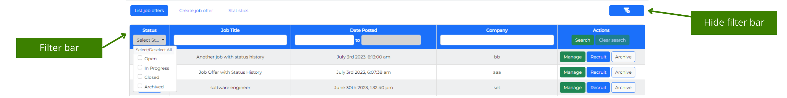

[User Guide](../README.md) > [How to](README.md)

# How to search for job offers

---

To search for job offers with specific criteria, you must follow these steps:

1. Go to the **Main** window.
1. Select the \***\*Display filter bar\*\*** button in the **Navigation** bar. It opens the **Filter** bar at the top of the **Jobs** table.

3. Enter information. You can edit the following fields:

- _Status_ dropdown– search for _open_, _in progress_ or _closed_ job offers. It allows to select multiple status.
- _Job title_ field – search for a title with free text.
- _Date posted_ field – search by date, specifying a start and an end date.
- _Company_ field – search for a company with free text.

4. Select the **Search** button in the **Actions** bar. The results will be displayed in the **Jobs** table.
5. Select the **Clear search** button in the **Actions** bar to clear the information, and the results. You can:

   - Search again by repeating the process from step 3.
   - Select the **Hide filter bar** button in the **Navigation** bar to hide the **Filter** bar.

> Note: When the query returns no results, the message - No job offers entries available - displays under the **Filter** bar.

 

