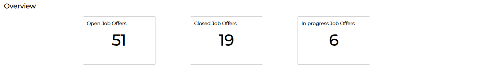
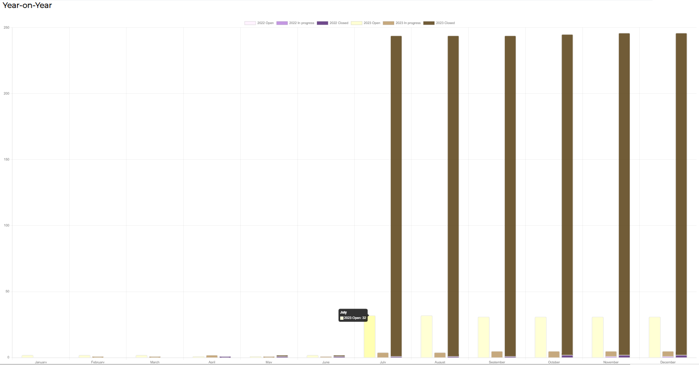
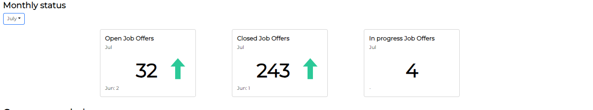
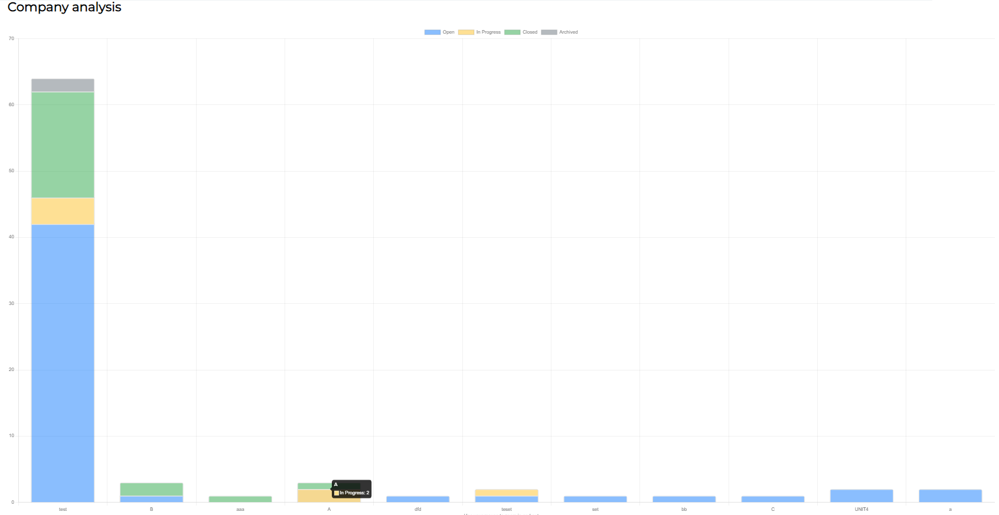

[User Guide](../README.md) > [How to](README.md)

# How to see and read the statistics functionality

---

To open the statistics functionality, you must follow these steps:

1. Go to the **Main** window.
1. Select the **Statistic** button in the **Navigation** bar. It redirects you to the **Statistics** window.

The **Statistics** window has the following sections:

### Overview section

---

This section provides general information on workload and the success of the recruiting company.

It shows, in separate tiles, the total amount of _open_, _closed_ and _in progress_ job offers at the moment of consulting.

### Year-on-year section

---

This section provides information that allows you to evaluate progress over time and gain insights into the trends and changes in job offer statuses.

It shows, in a stacked bar chart, a comparison between the current year and the previous year.

The information is displayed by comparing month by month the _open_, _in progress_ and _closed_ job offers. To see the specific data, you must hover over the bars.

The _Interactive_ legend allows you to decide which bars you want to display. You can select yearly status to turn them on and off.

### Monthly status section

---

This section provides information on monthly progress and monthly workload.

It shows, in separate tiles, a comparison between the total amount of _open_, _closed_ and _in progress_ job offers of the current month with the previous month. Green and red arrows allow you to know if the numbers increase or decrease.

The **Select month** dropdown allows you to change the comparison to the selected month and the previous month.

### Company analysis section

---

This section provides information that allows you to know for which companies you have recruited the most and the least.

It shows, in a stacked bar chart, the recruitment data for each company.

The information is displayed by status for each company. You can hover over to see the data and use the mouse to zoom in and out of the chart.

# How to download the statistics report

---

To download a report with the statistics information, you must:

- Select the **Download statistics** button to automatically download a .JPEG to your downloads folder.

 

