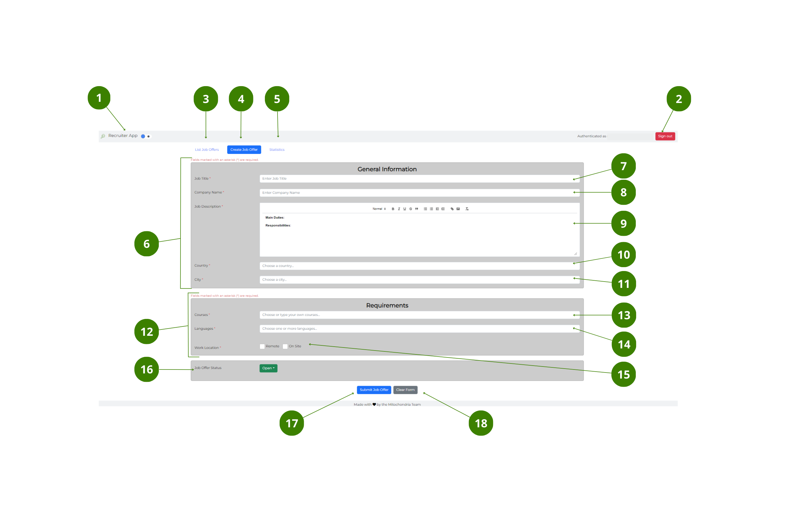

# Create job offer window

The user interface of the **Create job offer** window, has the following elements:

#### Top bar

---

1. **Dark/Light mode** button – toggle to switch between dark and light mode.
2. **Sign in/out** button – select to [**Sign in and out**](How-to/How-to-authenticate.md) of the App.

#### Navigation bar

---

3. **List job offers** button – select to go to the [**Main** window](Window-elements/Main-window.md).
4. **Create job offer** button – when blue, it indicates that the window is active. Follow the [link](How-to/How-to-create-a-job-offer.md) for more information on how to create a job offer.
5. **Statistics** button – select to go to the [**Statistics** window](Window-elements/Statistics-window.md).

#### Job Form

---

6. **General information** section – you must fill in the following information:
7. _Job title_ field – write the job title.
8. _Company name_ field – write the name of the company.
9. _Job description_ field – write the job description in the word processor.
10. _Country_ dropdown – choose your country.
11. _City_ dropdown – choose your city.
12. **Requirements** section – you must fill in the following information:
13. _Courses_ dropdown – choose the required course or courses.
14. _Languages_ dropdown – choose the required language or languages.
15. _Work location_ check box – check one or both boxes for _Remote_ or _On site_ work location.
16. **Job offer status** dropdown – choose between:

- _Open_ – the selection process is still open for candidates.
- _In progress_ – no further applications are allowed.
- _Closed_ – selection process is closed.

#### Bottom bar

---

17. **Submit job offer** button – select to submit the _Job_ form.
18. **Clear form** button – select to delete the information in the _Job_ form.

 

