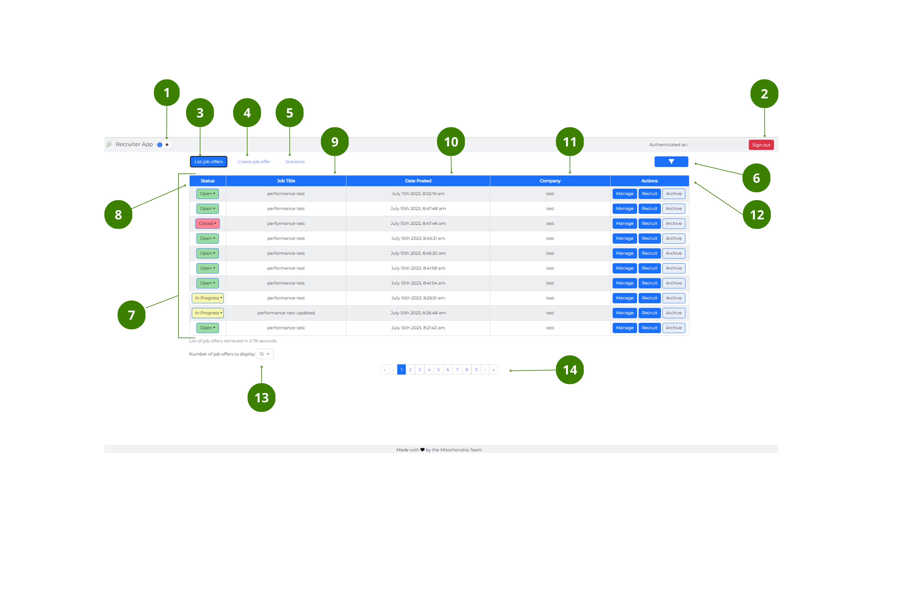

[User Guide](../README.md) > [window elements](README.md)

# Main window

The user interface of the **Main** window, has the following elements:

#### Top bar

---

1. **Dark/Light mode** button – toggle to switch between dark and light mode.
2. **Sign in/out** button – select to [**Sign in and out**](../How-to/How-to-authenticate.md) of the App.

#### Navigation bar

---

3. **List job offers** button – when blue, it indicates that the window is active.
4. **Create job offer** button – select to go to the [**Create job offer** window](Create-job-offer-window.md).
5. **Statistics** button – select to go to the [**Statistics** window](Statistics-window.md).
6. **Display/hide filter bar** button – Select to display the **Filter** bar. Follow the [link](../How-to/How-to-search-for-job-offers.md) for more information on how to search for job offers.

#### Jobs table

---

7. _Job offers_ table – it displays a list of the most recent job offers.
8. _Status_ dropdown– it indicates the status of the job offer. You can choose between: _open_, _in progress_ or _closed_.
9. _Job title_ field – it indicates the name of the job that is offered.
10. _Date posted_ field – it indicates when the job offer was posted.
11. _Company_ field – it indicates the company offering the job.
12. _Actions_ field – it allows you to [**Manage**](../How-to/How-to-manage-a-job-offer.md), [**Recruit**](../How-to/How-to-recruit-candidates.md) or [**Archive/Unarchive**](../How-to/How-to-archive-and-unarchive-a-job-offer.md) the job offer by using the buttons.

#### Bottom bar

---

13. **Number to display** dropdown – allows you to choose the number of offers displayed (5, 10 or 15).
14. **Pagination** bar - shows the number of pages available and highlights your current location in blue.

 

