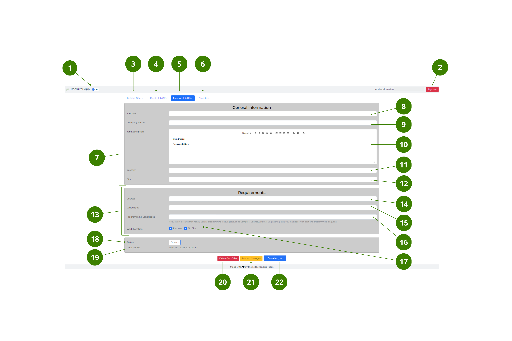

[U4Academy](../../README.md) > [User Guide index](../README.md) > [window elements](README.md) > Manage a job offer window

# Manage job offer window

The user interface of the **Manage Job Offer** window, has the following elements:

#### Top bar

---
<ol>
<li> <b>Dark/Light mode</b> button – toggle to switch between dark and light mode.</li>
<li> <b>Sign in/out</b>  button – select to <a href="../How-to/How-to-authenticate"><b>Sign in and out</b></a> of the App.</li>
</ol>

#### Navigation bar

---

<ol start="3">
<li> <b>List job offers</b>  button – select to go to the <a href="Main-window"><b>Main</b> window</a>.</li>
<li> <b>Create job offer</b>  button – select to go to the [<b>Create job offer</b>  window](Create-job-offer-window.md).</li>
<li> <b>Manage job offer</b>  button – when blue, it indicates that the window is active. Follow the <a href="../How-to/How-to-manage-a-job-offer"><b>link</b></a> for more information on how to manage a job offer.</li>
<li> <b>Statistics</b>  button – select to go to <a href="Statistics-window"><b>Statistics</b> window</a>.</li>
</ol>

#### Job Form

---

<ol start="7">
<li> <b>General information</b>  section – you can modify the following information:</li>
<li> <i>Job title</i> field – edit the job title.</li>
<li> <i>Company name</i> field – edit the name of the company.</li>
<li> <i>Job description</i> field – edit the job description in the word processor.</li>
<li> <i>Country_ dropdown – edit the country.</li>
<li> <i>City</i> dropdown – edit the city.</li>
<li> <b>Requirements</b>  section – you can modify the following information:</li>
<li> <i>Courses</i> dropdown – edit the required course or courses.</li>
<li> <i>Languages</i> dropdown – edit the required language or languages.</li>
<li> <i>Programming languages</i> dropdown – edit the required programming language or languages. This field is only available when technical courses are selected.</li>
<li> <i>Work location</i> check box – check one or both boxes for <i>Remote</i> or <i>On site</i> work location.</li>
<li> <b>Job Offer Status</b>  dropdown – choose between:</li>
</ol>

<ul>
<li> <i>Open</i> – the selection process is still open for candidates.</li>
<li> <i>In progress</i> – no further applications are allowed.</li>
<li> <i>Closed</i> – the selection process is closed.</li>
</ul>

<ol start="19">
<li> <b>Date posted</b>  – date and time when the job offer was posted. This field generates automatically and it cannot be edited.</li>
</ol>

#### Bottom bar

---

<ol start="20">
<li> <b>Delete job offer</b>  button – select to delete the job offer.</li>
<li> <b>Discard changes</b>  button – select to discard the changes added to the <i>Job</i> form.</li>
<li> <b>Save changes</b>  button – select to save the changes added to the <i>Job</i> form.</li>
</ol>

 

