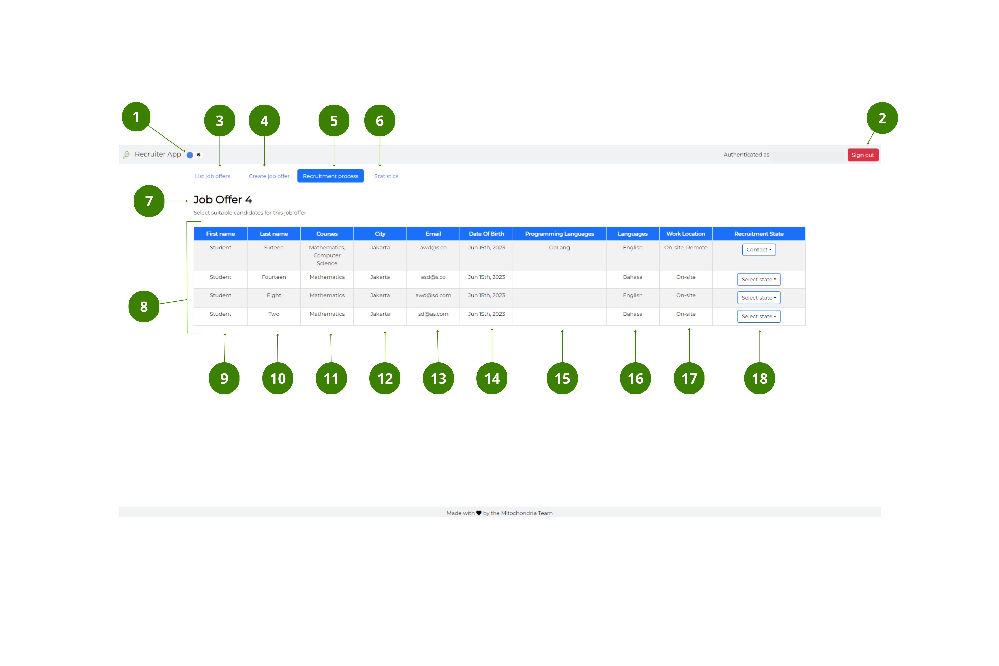

# Recruit window

The user interface of the **Recruit** window has the following elements:

#### Top bar

---

1. **Dark/Light mode** button – toggle to switch between dark and light mode.
2. **Sign in/out** button – select to [**Sign in and out**](../How-to/How-to-authenticate.md) of the App.

#### Navigation bar

---

3. **List job offers** button – select to go to [**Main** window](Main-window.md).
4. **Create job Offer** button – select to go to [**Create a job offer** window](Create-job-offer-window.md).
5. **Recruitment process** button: when blue, it indicates that the window is active. Follow the [link](../How-to/How-to-recruit-candidates.md) for more information on how to recruit a candidate.
6. **Statistics** button – select to go to the [**Statistics** window](Statistics-window.md).

#### Candidates list

---

7. _Job title_ – it displays the title of the job offer.
8. _Candidates_ table – it displays a list of potential candidates.
9. _First name_ field – it indicates the first name of the potential candidate.
10. _Last name_ field – it indicates the last name of the potential candidate.
11. _Courses_ field – it indicates what course or courses the candidate has studied.
12. _City_ field – it indicates the city where the potential candidate could work from.
13. _Email_ field – it indicates the email address of the potential candidate.
14. _Date of birth_ field – it indicates the date of birth of the potential candidate.
15. _Programming languages_ field – it indicates what programming language or languages the candidate knows.
16. _Languages_ field – it indicates what language or languages the candidate knows.
17. _Work location_ field – it indicates whether the candidate can work _on-site, remote_ or both.
18. _Recruitment state_ dropdown– it indicates the current state of the recruitment process. You can choose between: _contact, interview scheduled, interviewed, dismissed_ and _hired_. Follow the [link](../How-to/How-to-recruit-candidates.md) for more information.

> Note: All changes in the recruitment state process are automatically saved.

 

