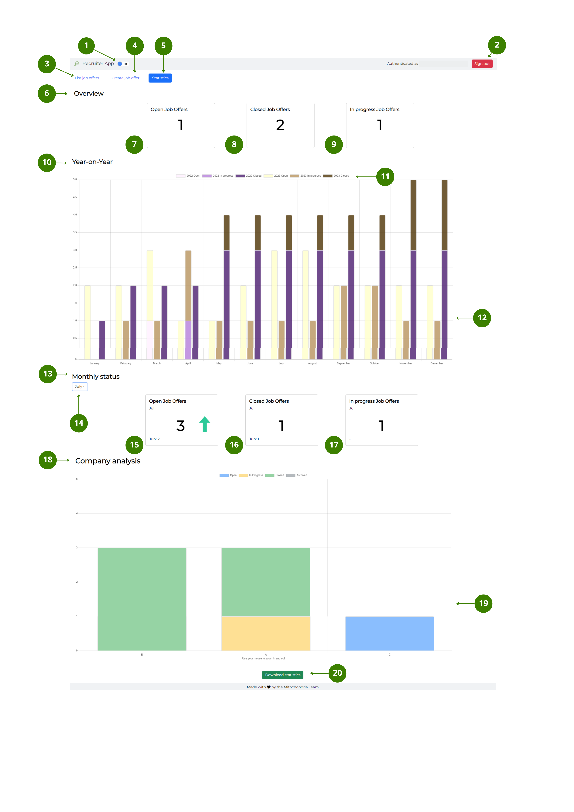

[U4Academy](../../README.md) > [User Guide index](../README.md) > [window elements](README.md) > Statistics window

# Statistics window

The user interface of the **Statistics** window, has the following elements:

#### Top bar

---
<ol>
<li> <b>Dark/Light mode</b> button – toggle to switch between dark and light mode.</li>
<li> <b>Sign in/out</b> button – select to <a href="../How-to/How-to-authenticate"><b>Sign in and out</b></a> of the App.</li>
</ol>

#### Navigation bar

---

<ol start="3">
<li> <b>List job offers</b> button – select to go to the <a href="Main-window"><b>Main</b> window</a>.</li>
<li> <b>Create job offer</b> button – select to go to the <a href="Create-job-offer-window"><b>Create job offer</b> window</a>.</li>
<li> <b>Statistics</b> button – when blue, it indicates that the window is active. Follow the <a href="../How-to/How-to-see-and-read-the-statistics-funtionality">link</a> for more information on how to see and read the statistics functionality.</li>
</ol>

#### Statistics functionality

---

<ol start="6">
<li> <b>Overview</b> section – you will find the following information:</li>
<li> <i>Total amount of open job offers</i>  tile – it displays the current total amount of open job offers.</li>
<li>  <i>Total amount of closed job offers</i>  tile – it displays the current total amount of closed job offers.</li>
<li>  <i>Total amount of in progress job offers</i>  tile – it displays the current total amount of in progress job offers.</li>
<li>  <b>Year-on-year</b> section – you will find the following information:</li>
<li>  <i>Interactive</i>  legend – select the different legend elements to make them appear and disappear from the stack bar chart.</li>
<li>  <i>Year-on-year</i>  stacked bar chart – it displays a comparison between the current year job offers and the past year job offers. The information is organised by month and divided by status.</li>
<li>  <b>Monthly status</b> section – you will find the following information:</li>
<li>  <i>Select month</i>  dropdown – choose the month you want to compare.</li>
<li>  <i>Open job offers</i>  tile – it displays the total amount of open job offers for the selected month compared to the previous month.</li>
<li>  <i>Closed job offers</i>  tile – it displays the total amount of closed job offers for the selected month compared to the previous month.</li>
<li>  <i>In progress job offers</i> tile – it displays the total amount of in progress job offers for the selected month compared to the previous month.</li>
</ol>

> Note: By default, the **Monthly status** section displays a comparison between current and previous month.

<ol start="18">
<li> <b>Company analysis</b> section – you will find the following information:</li>
<li>  <i>Company</i> stacked bar chart – it displays the total amount of job offers for each company and for the current year. The information is divided by status.</li>
<li>  <i>Download statistics</i> button– it allows you to download a .JPEG report with all the data.</li>
</ol>

 

